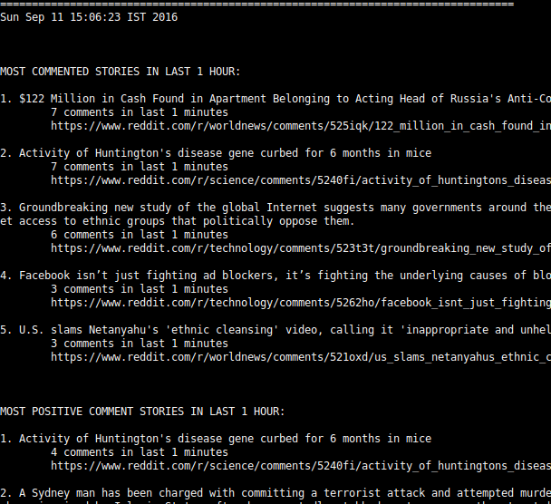

# Reddit Comments Sentiment Analysis Topology for Apache Storm

## Overview

This project implements a sentiment analyzer [Storm](http://storm.apache.org/) topology for Reddit comments. 

It demonstrates how Storm can be used for realtime mining and aggregation of high velocity data streams.

Given a list of [subreddits](https://www.reddit.com/reddits/), the topology polls the RSS feeds of each subreddit
every 30 secs, updates comment counts, calculates sentiment scores for comments, and publishes the results to
the cluster's associated Zookeeper server/cluster at the znode path "/reddit". 

A _Viewer App_ subscribes to the same Zookeeper server/cluster, monitors changes to "/reddit", and displays the results
whenever they change. 


**Sentiment Calculation**
  
The sentiment score calculation is a very naive one - simply sum up 
[AFINN](http://www2.imm.dtu.dk/pubdb/views/publication_details.php?id=6010) scores 
of all words in each comment. 

There is no machine learning or statistical model implemented here, but implementing one should 
be fairly straightforward using Trident ML. 

See [SentimentCalculatorBolt](../master/src/main/java/storm/redditsentiment/SentimentCalculatorBolt.java) for 
calculation implementation.


## Usage

### 1. Deploy the topology to a Storm cluster

- Download `redditsentiment-cluster-all.jar` to any node of the Storm cluster.

	```bash
	
    $ wget https://github.com/pathbreak/reddit-sentiment-storm/releases/download/release-1.0.0/redditsentiment-cluster-all.jar

	```
	
    
   
- Start the topology using this command line:

	```bash
	
    $ storm jar redditsentiment-cluster-all.jar storm.redditsentiment.RedditSentimentTopology <subreddit-1> <subreddit-2> ...
    
	```
	
  Example:

	```bash
	
    $ storm jar redditsentiment-cluster-all.jar storm.redditsentiment.RedditSentimentTopology worldnews technology science
    
	```
	
### 2. View Results 

The topology publishes 3 lists:

- Top 5 most commented stories across all given subreddits

- Top 5 stories with most positive comments across all given subreddits

- Top 5 stories with most negative comments across all given subreddits


Run the _Viewer App_ to display these lists in realtime:

+ Download `redditsentiment-viewer.jar` to a machine which can access the Zookeeper server/cluster.

	```bash
	
    $ wget https://github.com/pathbreak/reddit-sentiment-storm/releases/download/release-1.0.0/redditsentiment-viewer.jar
    
	```
	
+ Find out the IP address and port of Zookeeper server or any node of the Zookeeper cluster.
  Examine the Storm cluster's `conf/storm.yaml` for these settings. 
  The Zookeeper port is usually 2181 for a standalone Zookeeper node, or 2000 for Storm's embedded Zookeeper node 
  when running in local mode.
  
+ Run the _Viewer App_:
	
	```bash
	
    $ java -jar redditsentiment-viewer.jar [IP-ADDRESS-OF-ZOOKEEPER-NODE] [PORT-OF-ZOOKEEPER-DAEMON]
    
	```

**Viewer screenshot**




### 3. Test the topology on a local Storm cluster

It's possible to test the topology in Storm's local cluster mode on a development machine.

- Download `redditsentiment-local-all.jar` to development machine.

	```bash
	
    $ wget https://github.com/pathbreak/reddit-sentiment-storm/releases/download/release-1.0.0/redditsentiment-local-all.jar
    
	```
	
    
- Start the local Storm harness and topology using this command line:

	```bash
	
    $ java -jar redditsentiment-local-all.jar LOCAL <subreddit-1> <subreddit-2> ...
    
	```
- Run the _Viewer App_ as described in [View Results](2-view-results), giving `localhost` and `2000` as Zookeeper host and port.
 


## Build

+ Install Apache Maven2/3

+ Clone this repo:
	
	```bash
	$ git clone https://github.com/pathbreak/reddit-sentiment-storm.git
	
	$ cd reddit-sentiment-storm
	``` 

+ Run Maven compilation and packaging tasks:

	```bash

	reddit-sentiment-storm$ mvn clean package`

	```


+ 3 JARs are produced under `reddit-sentiment-storm/dist` directory:

   + **redditsentiment-cluster-all.jar**
     
     This JAR is suitable for deploying on a Storm cluster.  

   + **redditsentiment-local-all.jar**
     
     This JAR is for testing the topology in a standalone Storm harness on your development machine. See [Test topology on local storm cluster](3-test-the-topology-on-a-local-storm-cluster).  

   + **redditsentiment-viewer.jar**
     
     This is the Viewer console app JAR to display results of the analysis.  See [View Results](2-view-results).


## Credits

- This project uses the AFINN database for word sentiment scores. See [Citation](citation) below. 


## Citation

+ Finn Årup Nielsen, "A new ANEW: evaluation of a word list for sentiment analysis in microblogs", Proceedings of the ESWC2011 Workshop on 'Making Sense of Microposts': Big things come in small packages. Volume 718 in CEUR Workshop Proceedings: 93-98. 2011 May. Matthew Rowe, Milan Stankovic, Aba-Sah Dadzie, Mariann Hardey (editors)
Paper with supplement: http://www2.imm.dtu.dk/pubdb/views/edoc_download.php/6006/pdf/imm6006.pdf


## References

+ [Apache Storm](http://storm.apache.org/)

+ AFINN: 

  - [AFINN](http://www2.imm.dtu.dk/pubdb/views/publication_details.php?id=6010)
  
  - https://github.com/fnielsen/afinn 


## License

- All code is licensed under MIT License, Copyright Karthik Shiraly

- AFINN is licensed under the [Open Database License](https://github.com/fnielsen/afinn/blob/master/afinn/data/LICENSE), Copyright F.Nielsen
